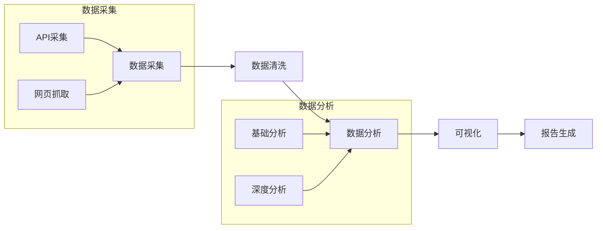

# 视频搜索和分析工具

📊 一站式视频数据分析平台，助你洞察内容创作趋势，提升创作效率。支持主流短视频平台数据采集和分析，让数据驱动你的创作决策。


## ✨ 核心特性

- 🔍 **智能搜索**：跨平台视频搜索，支持抖音、快手、B站等
- 📊 **数据分析**：自动分析播放量、互动数据、评论情感等
- 📈 **趋势洞察**：发现热门话题，预测内容走向
- 📑 **报告导出**：生成美观的分析报告，支持多种格式

## 🛠️ 工作原理



### 处理流程

1. **数据采集**
   - 调用平台API获取数据
   - 使用网页抓取补充数据
   - 自动处理反爬限制

2. **数据清洗**
   - 去除无效数据
   - 统一数据格式
   - 补充缺失字段

3. **数据分析**
   - 计算核心指标
   - 识别内容特征
   - 发现潜在趋势

4. **可视化展示**
   - 生成数据图表
   - 制作分析报告
   - 导出多种格式

## 📱 支持平台

平台 | 数据指标 | 更新频率
---|---|---
抖音 | 播放量、点赞、评论、分享 | 实时
快手 | 播放量、点赞、评论、分享 | 实时
B站 | 播放量、点赞、投币、收藏 | 实时
小红书 | 点赞、收藏、评论 | 每小时
YouTube | 播放量、订阅、评论 | 每小时
视频号 | 播放量、点赞、评论 | 每天

## 📦 系统要求

- Python 3.8+
- Chrome 浏览器
- 稳定网络环境

## 🔧 安装指南

### Windows 安装

1. **安装 Python 环境**
   ```bash
   # 下载并安装 Python 3.8+ (https://www.python.org/downloads/)
   # 安装时勾选 "Add Python to PATH"
   ```

2. **安装 Visual C++ Build Tools（如果没有）**
   - 下载地址：[Visual C++ Build Tools](https://visualstudio.microsoft.com/visual-cpp-build-tools/)

3. **安装 Chrome 浏览器**（如果没有）
   - 下载地址：[Chrome](https://www.google.com/chrome/)

4. **创建项目环境**
   ```bash
   # 克隆项目
   git clone https://github.com/whotto/Hot_video_collection_workflow.git
   cd Hot_video_collection_workflow

   # 创建虚拟环境
   python -m venv venv
   .\venv\Scripts\activate

   # 安装依赖
   pip install -r requirements.txt
   ```

### macOS 安装

1. **安装系统依赖**
   ```bash
   # 安装 Homebrew（如果没有）
   /bin/bash -c "$(curl -fsSL https://raw.githubusercontent.com/Homebrew/install/HEAD/install.sh)"

   # 安装 Python
   brew install python@3.8

   # 安装 Chrome
   brew install --cask google-chrome
   ```

2. **创建项目环境**
   ```bash
   # 克隆项目
   git clone https://github.com/whotto/Hot_video_collection_workflow.git
   cd Hot_video_collection_workflow

   # 创建虚拟环境
   python3 -m venv venv
   source venv/bin/activate

   # 安装依赖
   pip install -r requirements.txt
   ```

### Linux (Ubuntu/Debian) 安装

1. **安装系统依赖**
   ```bash
   # 更新系统包
   sudo apt-get update
   sudo apt-get install -y python3-dev python3-venv build-essential

   # 安装 Chrome
   sudo apt-get install -y chromium-browser
   ```

2. **创建项目环境**
   ```bash
   # 克隆项目
   git clone https://github.com/whotto/Hot_video_collection_workflow.git
   cd Hot_video_collection_workflow

   # 创建虚拟环境
   python3 -m venv venv
   source venv/bin/activate

   # 安装依赖
   pip install -r requirements.txt
   ```

### 使用国内镜像（可选）

如果下载速度较慢，可以使用清华镜像源：
```bash
pip install -r requirements.txt -i https://pypi.tuna.tsinghua.edu.cn/simple
```

## 🚀 快速开始

1. **配置环境变量**
   ```bash
   # 复制环境变量示例文件
   cp .env.example .env
   
   # 编辑 .env 文件，填入必要的配置信息
   # EXA_API_KEY=your_api_key_here
   ```

2. **基础搜索**
   ```bash
   # 搜索单个平台
   python analyzer.py -k "搜索关键词" -p bilibili

   # 搜索多个平台
   python analyzer.py -k "搜索关键词" -p bilibili,douyin,kuaishou
   ```

3. **高级分析**
   ```bash
   # 启用深度分析
   python analyzer.py -k "搜索关键词" --deep-analysis

   # 导出PDF报告
   python analyzer.py -k "搜索关键词" --export pdf
   ```

## 📊 使用场景

场景 | 功能描述
---|---
内容创作 | 发掘热门话题，分析爆款原因
竞品分析 | 跟踪竞品动态，对标数据表现
营销监测 | 追踪活动效果，评估传播价值
市场研究 | 把握行业趋势，预测发展方向

## 🔜 开发计划

- [ ] 支持更多数据维度分析
- [ ] 添加AI趋势预测功能
- [ ] 开发Web可视化界面
- [ ] 支持自定义数据导出模板

## ❗ 常见问题

1. **安装依赖失败**
   - 检查 Python 版本是否 >= 3.8
   - 确保已安装 Visual C++ Build Tools (Windows)
   - 尝试使用国内镜像源

2. **Chrome 驱动问题**
   - 确保已安装最新版 Chrome 浏览器
   - 尝试手动下载对应版本的 ChromeDriver

3. **网络连接问题**
   - 检查网络连接是否稳定
   - 考虑使用代理服务器
   - 确保 API 密钥配置正确

## 🤝 参与贡献

欢迎提交 Issue 和 Pull Request！

1. Fork 项目
2. 创建分支 (`git checkout -b feature/AmazingFeature`)
3. 提交更改 (`git commit -m 'Add AmazingFeature'`)
4. 推送分支 (`git push origin feature/AmazingFeature`)
5. 提交 PR

## 📄 开源协议

MIT License © 2024 玄清

## 🙏 鸣谢

- [Exa.ai](https://exa.ai) - 提供智能搜索支持
- [yt-dlp](https://github.com/yt-dlp/yt-dlp) - 视频信息提取
- [Selenium](https://www.selenium.dev/) - 自动化支持

## 📞 联系作者

- 博客：[天天悦读](https://yuedu.biz)
- Email：grow8org@gmail.com
- GitHub：[github.com/xuanqing](https://github.com/whotto/Hot_video_collection_workflow)

---

如果这个项目对你有帮助，请给个⭐️支持一下！
